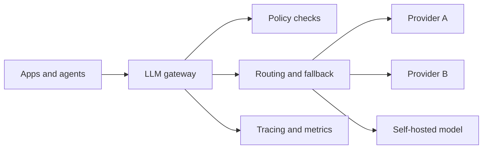

# Design an LLM Gateway / Proxy

An LLM gateway sits between applications and model providers. In mature systems it is not just a proxy. It is the control point for routing, policy, quota enforcement, trace normalization, and gradual change management.

## Problem framing

Multiple applications and agents need model access, but duplicated provider logic leads to inconsistent retries, weak governance, and fragmented observability.

## Functional requirements

- route requests across providers, models, or deployments
- enforce policy, quota, and budget controls
- normalize request and trace metadata
- support retries, fallbacks, and optional caching
- centralize prompt and configuration version selection where appropriate

## Non-functional requirements

- low incremental latency relative to direct provider calls
- high availability because many downstream systems depend on it
- enough transparency that application teams can debug routing and policy outcomes
- compatibility with structured outputs, streaming, and provider-specific features

## High-level architecture

## Core components

- request normalization layer
- policy and quota engine
- routing and fallback engine
- prompt and configuration registry
- cache and retry layer where justified
- trace export and cost accounting pipeline

## Data flow / request flow

1. An application sends a normalized request with task, tenant, and user metadata.
2. The gateway evaluates policy, quotas, and configuration state.
3. The routing layer selects a target model or fallback chain.
4. The provider adapter executes the call and emits standardized traces.
5. The gateway returns the response plus metadata useful to callers and operators.

## Scaling and reliability

- keep adapters isolated so provider failures do not poison the full gateway
- make routing decisions observable enough to debug cost and quality changes
- treat caching as an explicit product choice, not a hidden optimization
- separate control-plane configuration rollout from hot-path request serving

## Trade-offs

- centralization improves consistency but creates a shared critical dependency
- abstraction improves portability but can hide valuable provider differences
- caching reduces cost but can mask prompt or model regressions
- policy enforcement at the gateway simplifies app logic but may not be enough for application-specific safety constraints

## Failure modes

- the gateway becomes a thin pass-through with little value
- routing logic is opaque and hard to explain to application owners
- policy expectations diverge between the gateway and the app layer
- one misconfigured rollout affects many downstream systems at once

## Security / safety / governance

- use the gateway as a consistent point for provider credentials and outbound access
- record which policy and prompt versions were active for each request
- keep tenant and user metadata accurate enough for audit and incident review
- avoid turning the gateway into a hidden application-logic layer with unclear ownership

## Interview discussion points

- What belongs in a gateway versus in the application itself?
- How would you avoid over-abstracting provider differences?
- How should rollout, fallback, and policy changes be audited?
- When is a gateway justified, and when is it premature?
