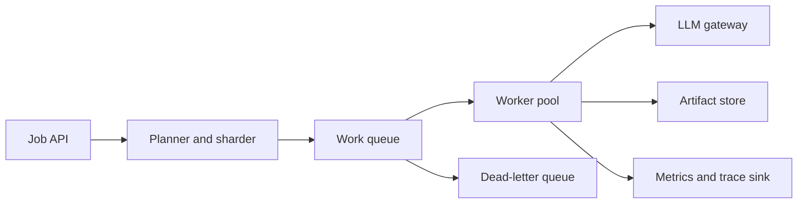

# Design an Offline Batch Inference Service

Offline batch inference matters when the system needs throughput, repeatability, and cost efficiency more than interactive latency. Typical uses include document enrichment, catalog tagging, bulk summarization, classification backfills, and nightly quality checks.

## Problem framing

The system must process large collections of records with model-backed transformations while preserving job visibility, retry safety, and cost control.

## Functional requirements

- accept large inference jobs with explicit input sets
- support different tasks such as tagging, classification, and summarization
- track per-job and per-record status
- retry failed items without replaying successful work
- persist outputs and metadata for downstream systems

## Non-functional requirements

- high throughput and predictable cost
- resumability after worker or provider failures
- idempotent execution for retries and replays
- auditability for model version, prompt version, and input lineage
- tenant isolation if multiple teams use the same service

## High-level architecture

## Core components

- job submission API
- planner that shards large jobs into stable work units
- queue or scheduler that controls worker concurrency
- worker pool with idempotent task handlers
- LLM gateway for routing, quotas, and standardized traces
- artifact store for outputs, errors, and job metadata

## Data flow / request flow

1. A caller submits a job with inputs, task type, and model configuration.
2. The planner validates the request and creates shards or per-record tasks.
3. Workers pull tasks, fetch the relevant input payload, and call the LLM gateway.
4. Outputs, errors, and execution metadata are written to the artifact store.
5. Failed work is retried within policy limits or moved to a dead-letter queue.
6. Job-level metrics and summaries are exposed for operators and downstream consumers.

## Scaling and reliability

- shard jobs so retries do not replay the entire workload
- use idempotent write patterns for output persistence
- enforce concurrency and rate limits at the worker and gateway layers
- checkpoint progress so long jobs survive deploys or worker loss
- separate poison-record handling from transient provider failures

## Trade-offs

- bigger batches reduce per-item overhead but increase blast radius on failure
- aggressive concurrency improves throughput but raises quota and cost risk
- centralized batch infrastructure improves control but may slow product-specific iteration
- caching or deduplication can save cost but may hide freshness changes

## Failure modes

- non-deterministic retries that produce conflicting outputs
- partial writes that make job status look healthier than reality
- poison records that repeatedly fail and clog worker capacity
- unbounded backfills that starve higher-priority workloads

## Security / safety / governance

- restrict which datasets and prompts each tenant can run
- record model, prompt, and dataset versions for later audit
- apply data retention and redaction rules before prompts leave the platform
- keep service-account permissions narrower than the source data owner surface

## Interview discussion points

- How would you shard and retry work without duplicating outputs?
- Where would you enforce quotas and cost caps?
- What would you log so a bad job can be investigated later?
- When should a team use batch inference instead of online serving?
