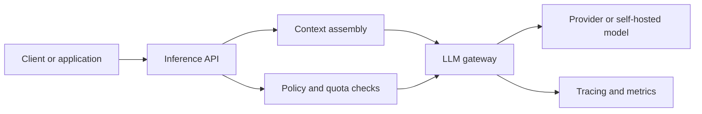

# Design an Online Inference Service

Online inference is the serving path for synchronous user or application requests. The design problem is not only calling a model quickly. It is doing so with predictable latency, safe degradation, and enough visibility to debug failures in production.

## Problem framing

The system must serve low-latency LLM-backed requests for applications such as chat, summarization, drafting, and workflow assistance while keeping routing, observability, and policy enforcement consistent.

## Functional requirements

- accept synchronous requests through a stable API
- support streaming or incremental responses when the product needs it
- route requests across models or providers
- attach request metadata for tracing, quotas, and experimentation
- return standardized error semantics to callers

## Non-functional requirements

- low and predictable latency
- high availability under provider or network failures
- graceful degradation when budgets, providers, or policies block a request
- per-tenant isolation for quotas and secrets
- traceability across retrieval, tool use, and model invocation

## High-level architecture

## Core components

- synchronous API layer
- context assembly service for prompts, metadata, or retrieved context
- policy and quota checks
- LLM gateway for routing, caching, and fallbacks
- trace and metric pipeline
- response formatter for streaming, citations, or structured outputs

## Data flow / request flow

1. A caller sends a request with user, task, and context metadata.
2. The service resolves configuration, policy, and quota state.
3. If needed, the system assembles prompt context from conversation state or upstream services.
4. The gateway selects a model path, invokes the provider, and records traces.
5. The service returns the response, optionally streaming tokens and structured metadata.
6. Logs, latency, cost, and quality signals feed observability and evaluation systems.

## Scaling and reliability

- use concurrency controls to protect provider quotas and internal dependencies
- isolate slow retrieval or tool dependencies from the core serving path
- add fallbacks or lower-cost models for degraded conditions where appropriate
- standardize timeouts and circuit-breaking so failures are visible and bounded
- keep the serving path stateless where possible and externalize session state

## Trade-offs

- richer context improves answer quality but hurts latency and cost
- central policy checks improve consistency but add a control-path hop
- provider abstraction helps portability but can hide model-specific capabilities
- streaming improves responsiveness but complicates moderation and retry semantics

## Failure modes

- queue buildup during provider latency spikes
- hidden tail latency from retrieval or tool dependencies
- inconsistent retries that duplicate partial outputs
- poor attribution when users see low quality but traces do not separate retrieval, policy, and model failures

## Security / safety / governance

- scope secrets and provider access by service and tenant
- redact or classify sensitive inputs before provider calls
- keep trace storage compliant with retention rules
- make policy decisions explainable enough that blocked requests can be reviewed

## Interview discussion points

- What belongs in the online path versus an asynchronous follow-up?
- How would you keep latency predictable during provider incidents?
- Where do you put quotas, retries, and fallbacks?
- What signals would tell you the service is healthy but user quality is degrading?
