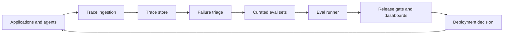

# Design an Evaluation & Observability System for LLM Applications

Evaluation and observability are the systems that keep LLM applications from turning into intuition-driven operations. The goal is to connect production behavior to datasets, release decisions, and debugging workflows.

## Problem framing

Teams need a reliable way to capture traces, turn failures into test coverage, and detect quality regressions before and after changes to prompts, models, retrieval, or tools.

## Functional requirements

- Capture structured traces across application, retrieval, tool, and model layers
- Store representative datasets for offline evaluation
- Run repeatable eval suites before releases
- Surface quality, latency, and cost trends to operators
- Support issue triage and failure clustering from production signals

## Non-functional requirements

- Reproducibility for runs and release decisions
- Clear lineage from trace to dataset to evaluation result
- Privacy-aware logging and retention
- Support for both automated checks and human review
- Enough performance isolation that evaluation workloads do not disrupt serving

## High-level architecture

## Core components

- Trace schema and ingestion pipeline
- Trace store with request, retrieval, tool, and model events
- Failure triage and clustering workflow
- Curated dataset registry
- Automated eval runner and human review queue
- Dashboards, alerts, and release gate integration

## Data flow / request flow

1. Applications emit standardized traces for requests, retrieved context, tool calls, outputs, and feedback.
2. Operators or automated rules cluster traces into recurring failure classes.
3. Important failures are converted into curated evaluation cases with labels or review notes.
4. Prompt, model, or architecture changes run against the eval suite before release.
5. Results feed dashboards, alerts, and explicit release decisions.
6. Production monitoring continues the loop after release so new failures become new coverage.

## Scaling and reliability

- Sample traces intelligently so storage cost does not erase signal
- Separate hot-path logging from heavier downstream enrichment
- Version datasets and prompts so results stay comparable over time
- Use multiple metrics instead of one aggregate score
- Assign ownership for keeping eval suites current as the system evolves

## Trade-offs

- Richer traces improve debugging but increase storage and privacy burden
- More human review improves signal quality but slows iteration
- Centralized release gates improve consistency but can frustrate teams if the metrics are poorly chosen
- Automated evaluators scale well but miss ambiguous or domain-specific failures

## Failure modes

- Collecting traces without converting them into reusable eval coverage
- Measuring generation quality while ignoring retrieval or tool quality
- Using noisy feedback without triage
- No rollback path when a change passes latency checks but fails user trust

## Security / safety / governance

- Define which trace fields may contain sensitive user or enterprise data
- Keep reviewer access scoped to the data they need
- Make release criteria visible enough that risky exceptions require explicit sign-off
- Retain enough lineage that incidents can be reconstructed after the fact

## Interview discussion points

- How would you connect production failures to pre-release evaluation?
- Which metrics belong in a release gate, and which belong only on dashboards?
- How much human review is necessary?
- What traces are essential for debugging retrieval, tool, and model regressions separately?
