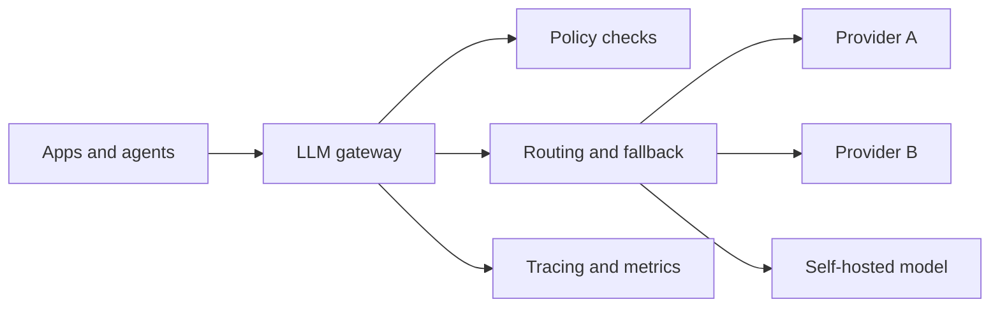

# Design an LLM Gateway / Proxy

An LLM gateway sits between applications and model providers. In mature systems it is not just a proxy. It is the control point for routing, policy, quota enforcement, trace normalization, and gradual change management.

## Problem framing

Multiple applications and agents need model access, but duplicated provider logic leads to inconsistent retries, weak governance, and fragmented observability.

## Functional requirements

- Route requests across providers, models, or deployments
- Enforce policy, quota, and budget controls
- Normalize request and trace metadata
- Support retries, fallbacks, and optional caching
- Centralize prompt and configuration version selection where appropriate

## Non-functional requirements

- Low incremental latency relative to direct provider calls
- High availability because many downstream systems depend on it
- Enough transparency that application teams can debug routing and policy outcomes
- Compatibility with structured outputs, streaming, and provider-specific features

## High-level architecture

## Core components

- Request normalization layer
- Policy and quota engine
- Routing and fallback engine
- Prompt and configuration registry
- Cache and retry layer where justified
- Trace export and cost accounting pipeline

## Data flow / request flow

1. An application sends a normalized request with task, tenant, and user metadata.
2. The gateway evaluates policy, quotas, and configuration state.
3. The routing layer selects a target model or fallback chain.
4. The provider adapter executes the call and emits standardized traces.
5. The gateway returns the response plus metadata useful to callers and operators.

## Scaling and reliability

- Keep adapters isolated so provider failures do not poison the full gateway
- Make routing decisions observable enough to debug cost and quality changes
- Treat caching as an explicit product choice, not a hidden optimization
- Separate control-plane configuration rollout from hot-path request serving

## Trade-offs

- Centralization improves consistency but creates a shared critical dependency
- Abstraction improves portability but can hide valuable provider differences
- Caching reduces cost but can mask prompt or model regressions
- Policy enforcement at the gateway simplifies app logic but may not be enough for application-specific safety constraints

## Failure modes

- The gateway becomes a thin pass-through with little value
- Routing logic is opaque and hard to explain to application owners
- Policy expectations diverge between the gateway and the app layer
- One misconfigured rollout affects many downstream systems at once

## Security / safety / governance

- Use the gateway as a consistent point for provider credentials and outbound access
- Record which policy and prompt versions were active for each request
- Keep tenant and user metadata accurate enough for audit and incident review
- Avoid turning the gateway into a hidden application-logic layer with unclear ownership

## Interview discussion points

- What belongs in a gateway versus in the application itself?
- How would you avoid over-abstracting provider differences?
- How should rollout, fallback, and policy changes be audited?
- When is a gateway justified, and when is it premature?
