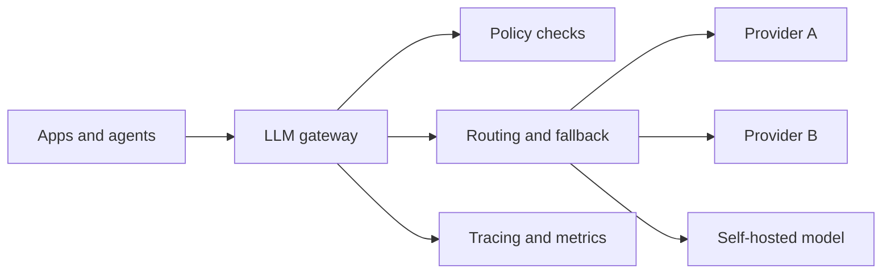

# LLM Gateway

An LLM gateway is the control point between applications and model providers. In a mature enterprise architecture, the gateway is not just a proxy. It is where teams enforce consistency, policy, and observability.

## What the gateway does

- routes requests across providers or models
- applies policy and quota controls
- normalizes tracing and logging
- supports retries, fallbacks, and caching
- centralizes prompt and configuration guardrails

## Reference diagram

## Why it exists

Without a gateway, every application tends to build its own:

- provider adapter
- retry logic
- token accounting
- safety wrapper
- telemetry format

That fragmentation slows teams down and weakens governance.

## Trade-offs

- extra hop and potential latency
- risk of over-abstracting provider-specific features
- temptation to centralize too much product logic

## Failure modes

- the gateway becomes a thin pass-through with little value
- routing logic is opaque and hard to debug
- cache behavior hides regressions
- policy enforcement diverges from application expectations
