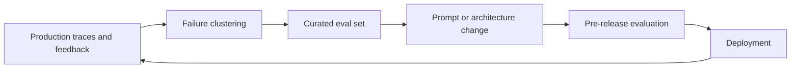

# Eval Flywheel

The eval flywheel is the pattern of turning real failures into better test coverage, then using that coverage to make future changes safer.

## Core idea

The loop is simple:

1. capture traces and user feedback
2. identify recurring failure classes
3. convert failures into curated evaluation cases
4. run those cases before shipping changes
5. repeat as new failures appear

## Reference diagram

## Why it matters

Without this loop, teams often fix incidents locally and then rediscover the same failures after the next prompt or model update.

## Design choices

- how traces are sampled and stored
- who labels ambiguous failures
- what qualifies as a release-blocking regression
- how eval coverage is tracked across retrieval, generation, and tool use

## Failure modes

- collecting traces but never curating them
- using noisy feedback without triage
- measuring only aggregate scores
- no owner for keeping eval sets current

